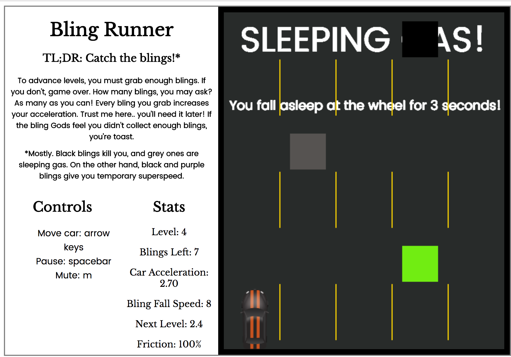
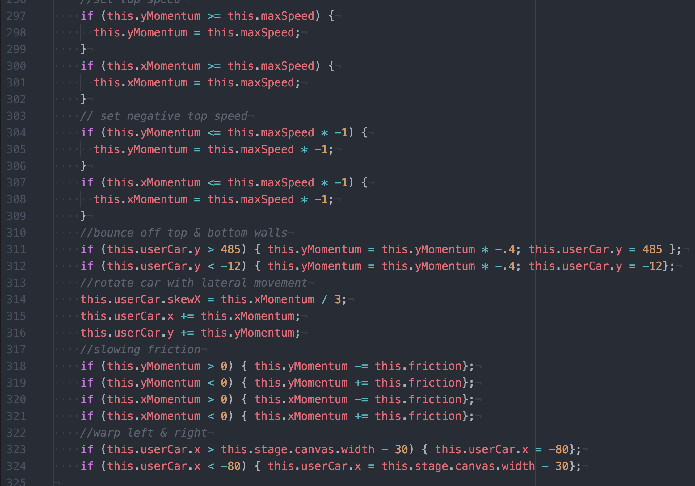
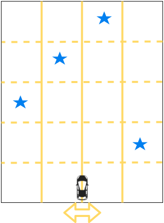

# BlingRunner

## Background

[BlingRunner](https://ravisraval.github.io/BlingRunner/) ([Github](https://github.com/ravisraval/BlingRunner) is a javascript browser game. Players control a car and must move the car over successive "blings": randomly generated objects on a scrolling board.

## Key Features, MVP
***
#### Infinitely Scrolling Board

  The game features a board that will continually scroll until a level is over. The level will end when a user successfully completes the level or misses too many blings, therefore losing.
  Blings are randomly generated parts of the board. The user must direct the car over these blings. When successful, the game will produce a corresponding sound. When unsuccessful, the game will play an error sound.
  Each successive level increases game difficulty in several ways. Chiefly, the speed at which blings move increases. Player acceleration increases with each captured bling, which means that player overall agility should generally scale with bling speed. Still, this means that player skill becomes more of a factor at higher level.

#### Buffs & Debuffs

  To build upon the excitement of the core gameplay, BlingRunner incorporates special beneficial or harmful blings. special, black blings are bombs that cause the player to instantly lose. Grey blings are sleeping gas, which disable all player input for three seconds. Finally, black & purple blings provide a temporary boost to player acceleration. These blings appear less frequently than the five core blings. To facilitate easier tweaking, this frequency is easily modified by changing one variable for each bling.

#### Bling Musical Playback
  Representing a staple of the rhythm music game genre, the five core blings each play a note when captured.

#### Robust Physics & User Interaction
  
  An excerpt of the game's physics code.

  The game's physics pivot upon several key easily modified variables and closely mimic the motion of a vehicle moving over a low friction surface. Future game updates may explore toggling an "ice mode," permitting users to actively set a friction coefficient. As is, the game carefully tracks vehicle momentum on the x and y axes.  Internally, friction, acceleration, max speed, bling fall / road scroll speed, and more. Additionally, the game handles warping the car from the right edge to the left, and vice-versa. The game also handles the car bouncing off the top and bottom walls with an appropriately lessened rebound.

  Further, the game involves an energetic and engaging background music and sound effects upon bling generation and capture. Users can pause and unpause the game at will by pressing space, and similarly can toggle a game-wide mute by pressing "m".

## Wireframes

## Technologies Utilized
BlingRunner uses the CreateJS suite to display images and play sound. In particular, EaselJS displays content on the canvas, and SoundJS assist handling audio loading and playback. All logic, including animation, is written in vanilla Javascript.

##Implementation Timeline

*  Day 1: Complete basic project setup, pause function, and car physics.
*  Day 2: Complete board scrolling, bling generation, and item collision.
*  Day 3: Complete point system, sounds, start styling and upgrades.
*  Day 4: Complete styling and upgrades.

## Potential Bonus Features

BlingRunner's core functionality could be improved upon with the following features:
*  Upgrades available via store after every level
*  Unlimited mode vs levels
*  start button
*  friction modifier
*  End level when all blings are out of canvas
*  Make a timed countdown from # blings left x bling pop countdown
*  Startup music & buff/debuff sound FX
*  Ability to charge (fast acceleration) to destroy impediments (orange barrels?)
*  Checkered Finish lines at the end of a level.
*  hit a jump, car scales up and back down - with a deadly crevice

##Bugs
*  Game motion is weird when replaying after game over.
*  Investigate pressing two control buttons at once
*  Collision
*  Stats rendering
